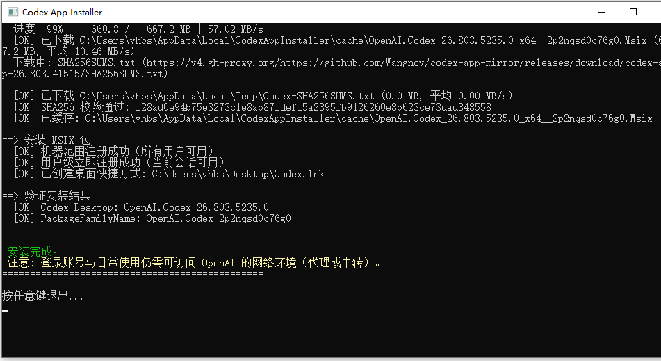
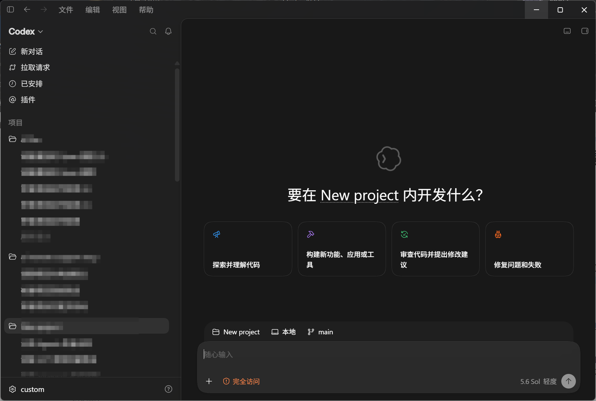

# OpenAI Codex 桌面应用一键安装程序（国内网络优化版，纯 C# 实现）

Windows 上绕过网络限制，一键安装 OpenAI Codex 桌面应用（MSIX）。全部逻辑由单个 C# 程序实现，实时显示下载进度与速度，自动完成 SHA256 校验、机器范围注册、聚合 API 配置与桌面快捷方式。

## 快速开始

双击 `CodexAppInstaller.exe`，UAC 弹窗点"是"，全程回车即可：

1. 自动下载 Codex MSIX（镜像加速，SHA256 校验，带缓存）
2. 静默安装（机器范围注册 + 用户级立即注册）
3. 聚合 API 配置（默认 Y：端点 `https://n.tokeness.io/v1`，模型 `gpt-5.6-sol`，粘贴 `sk-` Key 即可）
4. 创建桌面快捷方式

或直接参数指定：

```bat
CodexAppInstaller.exe -ApiKey sk-xxxxxx
```




## 文件

| 文件 | 说明 |
|---|---|
| `CodexAppInstaller.exe` | 最终分发物（全 C# 自包含，双击即用，自动提权） |
| `CodexAppInstaller.cs` | 完整源码（下载 / 校验 / 安装 / 聚合 API 配置 / 快捷方式） |
| `build-exe.bat` | 重新编译脚本（本机 .NET Framework csc + PowerShell SDK，无第三方依赖） |
| `img/` | 截图 |
| `README.md` | 本文档 |

## 用法

### 可选参数

| 参数 | 说明 |
|---|---|
| `-SkipApi` | 跳过聚合 API 配置 |
| `-ApiBaseUrl <url>` | 聚合端点（默认 `https://n.tokeness.io/v1`，需 OpenAI Responses 兼容） |
| `-ApiKey <key>` | API Key（格式 `sk-xxxxxx`） |
| `-ApiModel <model>` | 模型（默认 `gpt-5.6-sol`） |
| `-SkipChecksum` | 跳过 SHA256 校验（不推荐） |
| `-SkipShortcut` | 不创建桌面快捷方式 |
| `-h` | 帮助 |

## 工作原理

### 1. 绕过下载网络限制（多源回退）

| 优先级 | 来源 | 说明 |
|---|---|---|
| 1 | GitHub Release + gh-proxy（`v4.gh-proxy.org` → `gh-proxy.org` 双前缀回退） | 镜像仓库 [Wangnov/codex-app-mirror](https://github.com/Wangnov/codex-app-mirror)，tag 通过 `api.github.com` 动态获取 |

- 资产名按架构（x64 / arm64）从 Release 动态匹配，如 `OpenAI.Codex_26.803.5235.0_x64__2p2nqsd0c76g0.Msix`
- 下载用 **.NET HttpWebRequest 流式传输**（64KB 分块），进度/速度每 200ms 实时刷新，失败自动重试 3 次
- 下载后比对同 Release 的 `SHA256SUMS.txt`，防镜像篡改
- **下载缓存**：`%LOCALAPPDATA%\CodexAppInstaller\cache`（跨重启持久），SHA256 匹配直接复用，版本更新后哈希变化自动失效重下
- MSIX 为 **Microsoft Store 签名官方包**（未重打包），镜像仅转存

### 2. 安装 MSIX

进程内调用 PowerShell SDK：优先 `Add-AppxProvisionedPackage`（机器范围注册，所有用户可用）；机器范围注册不注册给当前用户，补一次用户级 `Add-AppxPackage` 立即生效；检测兜底 `Get-AppxProvisionedPackage`。

安装完成后创建 `Codex.lnk` 桌面快捷方式（WScript.Shell 指向 `shell:AppsFolder\<AUMID>`，AUMID 通过 `Get-StartApps` 动态获取——AppId 不一定是 `App`）。

### 3. 聚合 API 配置（桌面端 / CLI / IDE 三端共用）

Codex 桌面应用与 CLI、IDE 扩展**共用同一份 `~/.codex/config.toml`**（官方文档：agents in the app inherit the same configuration as the IDE and CLI extension），配置一次三端生效。

交互默认 Y，回车采用默认端点 `https://n.tokeness.io/v1` 与模型 `gpt-5.6-sol`。写入：

- `~/.codex/config.toml`（原配置备份 `config.toml.bak`）：
  ```toml
  model = "gpt-5.6-sol"
  model_provider = "custom"
  preferred_auth_method = "apikey"

  [model_providers.custom]
  name = "custom"
  base_url = "https://n.tokeness.io/v1"
  wire_api = "responses"          # Codex 仅支持 Responses 协议
  requires_openai_auth = true

  [windows]
  sandbox = "elevated"
  ```
- `~/.codex/auth.json`：`{"OPENAI_API_KEY": "sk-xxxxxx"}` —— Key 不落 config.toml；桌面端从桌面启动不读 shell 环境变量，auth.json 最可靠

配置后需**完全退出并重启** Codex 桌面应用生效。

## 边界与风险

- 本程序只解决**安装环节**的网络问题（下载安装包 / 组件）。**登录账号与日常使用**仍需要能访问 OpenAI 的网络环境（代理服务）。
- MSIX 来自第三方镜像但**未重打包**，按源比对官方 SHA256；对供应链敏感可自行从 Microsoft Store / winget 安装（`winget install --id 9PLM9XGG6VKS -s msstore`）。
- 需要 Windows 10/11 64 位、管理员权限。
- 聚合端点需 **OpenAI Responses 兼容**（`wire_api = "responses"`），纯 Chat Completions 端点无法直连。

## 故障排查

| 现象 | 处理 |
|---|---|
| 所有下载源失败 | 检查网络/代理连通性，或重试 |
| 401 鉴权失败 | 检查 `~/.codex/auth.json` 中 `OPENAI_API_KEY` 是否正确、账户余额是否充足 |
| 400 协议错误 | 端点必须 OpenAI Responses 兼容，纯 Chat Completions 不可用 |
| 配置不生效 | 完全退出（含托盘）并重启 Codex 桌面应用；确认 `~/.codex/config.toml` 存在且为你期望的内容 |
| 模型列表为空 | 检查端点 `/v1/models` 可用性与 `model` 模型 ID（默认 `gpt-5.6-sol`） |
